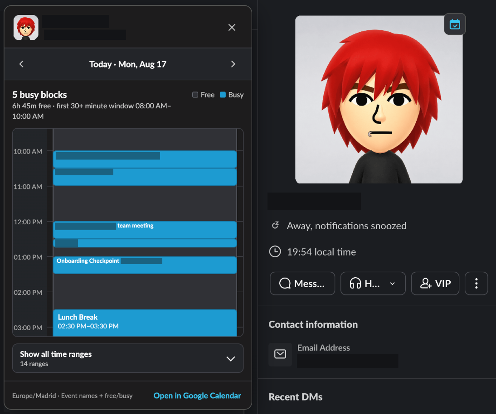

# calendar peek

small, open-source chrome/edge extension for checking a coworker's google calendar availability from google workspace or slack.



## what it does

### google workspace

click a coworker's avatar or name in gmail, calendar, drive, docs, meet, chat, or contacts. calendar peek adds a calendar button that opens google calendar's native **search for people** flow.

the toolbar popup is also available as a fallback. enter a work email and click **view calendar**.

### slack

on `app.slack.com` or another `*.slack.com` web url:

1. open a coworker's profile.
2. click the calendar peek button if slack exposes their email address.
3. use the popup to see event names, timeframes, busy blocks, and free windows.
4. move between previous, today, and next, or open the day in google calendar.

this works in slack's browser app only. no slack app, slack token, backend, or analytics.

## limitations

- slack must show the coworker's email in the profile ui.
- the email must match a google calendar identifier you can access.
- google calendar and workspace sharing settings still apply. calendar peek cannot bypass them.
- google and slack are changing single-page apps. ui changes may require updates to `src/slack.js`, `src/profile-card.js`, or `src/calendar.js`.

## install locally

1. open `chrome://extensions` in chrome, edge, brave, or another chromium browser.
2. enable **developer mode**.
3. click **load unpacked** and select this folder.
4. refresh open google workspace and slack tabs.

the fixed development extension id is:

```text
pcdcgkbgimicaioepjbghpmmjadeghej
```

## google oauth setup

the google workspace profile-card feature does not need oauth. the slack availability popup does, because google requires an authorized oauth client for calendar api access.

follow [`SETUP_GOOGLE_OAUTH.md`](SETUP_GOOGLE_OAUTH.md), or open **extension options** after loading the extension. the setup page can patch the selected `manifest.json` for you.

calendar peek requests these read-only scopes:

```text
https://www.googleapis.com/auth/calendar.events.freebusy
https://www.googleapis.com/auth/calendar.events.readonly
```

the first checks availability. the second reads event titles and times from calendars your account can already access. no descriptions, attendees, locations, or calendar editing access are requested.

## privacy and permissions

- no analytics, advertising, trackers, remote scripts, or external servers.
- no slack api access or slack tokens.
- slack profile data is read only from the page already visible to you.
- calendar requests go directly from the extension to google's official calendar api.
- google receives the selected coworker's email, selected time range, and browser time zone for the requested queries.
- private or restricted events may appear as a generic busy block.
- availability results stay in memory for up to two minutes while the slack tab is open.
- the google workspace handoff stores a pending email/name in `chrome.storage.local` for up to two minutes.

manifest permissions are used for:

- `identity`: google oauth after explicit authorization.
- `storage`: temporarily queue a coworker for google calendar.
- `tabs`: open or focus google calendar.
- `alarms`: remove an expired calendar handoff.
- google workspace hosts: detect profiles and use calendar's native people search.
- slack hosts: detect profiles and add the availability button.
- `www.googleapis.com`: call the read-only calendar api endpoints.

see [`PRIVACY.md`](PRIVACY.md) for the short privacy statement.

## development

```bash
node --check background.js src/*.js popup/*.js options/*.js
node tests/manifest.test.js
node tests/availability-utils.test.js
node tests/background.test.js
node tests/run-browser-smoke.js
```

the browser smoke test uses an isolated slack profile fixture. it checks button injection, profile reuse, popup rendering, event titles, and free/busy blocks without connecting to a real account.

## project structure

```text
manifest.json       extension manifest
background.js       service worker
src/                calendar, slack, profile, and shared logic
popup/              toolbar popup
options/            oauth setup page
tools/              oauth configuration helper
tests/              unit and browser smoke tests
icons/              extension icons
```

## license

MIT
